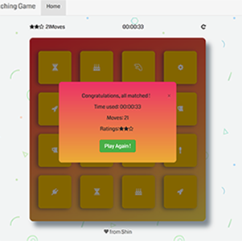
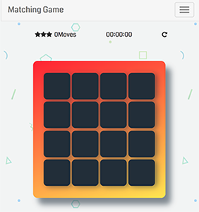

# Matching game
A classic card flip matching game !
It's a single-page responsive Angular web-application generated with [yo angular generator](https://github.com/yeoman/generator-angular) version 0.16.0.

## Build & development
Make sure you have before running.
To install denpendencies, in root folder, please run
`npm install package.json`
and
`bower install bower.json`

Then run `grunt` for building and `grunt serve` for preview.

## Game rule
- Click a card to flip to up side
- First card hold up before clicking the second
- If two cards show the same item, then match
- If not, both cards flip bottom
- Timer starts when the very first cards is revealed
- Reset button uppper right to reset game
- When all match, game finished
- Stars ratings are given based on number of moves